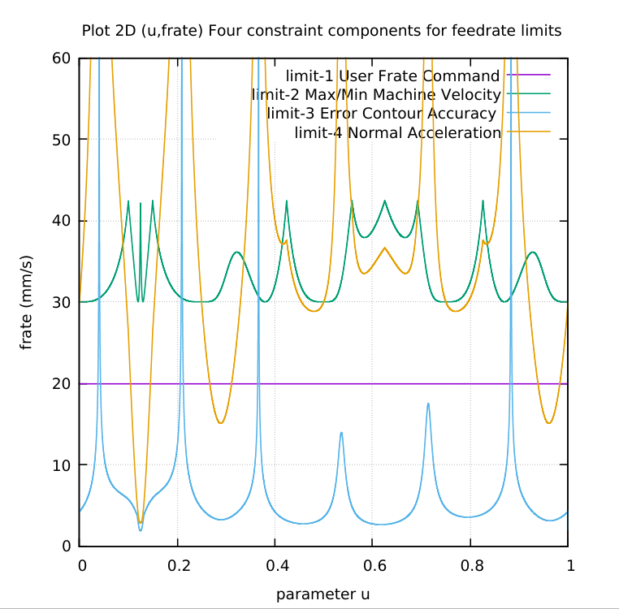
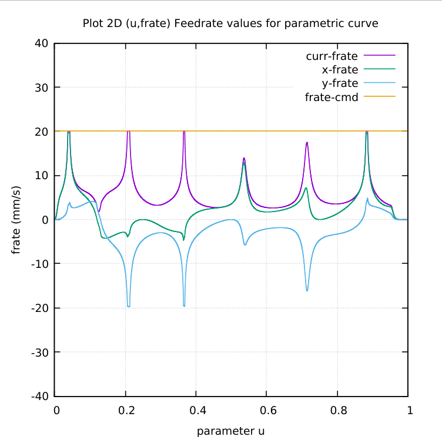

# ASTEPI-parametric-curve
ASTEPI (Astroid + Epicycloid) parametric GCode generation for CNC milling

# The four(4) contributions to the Feedrate Limit

# Current feedrate = minimum of feedrate limits

Wassalam.
WRY
